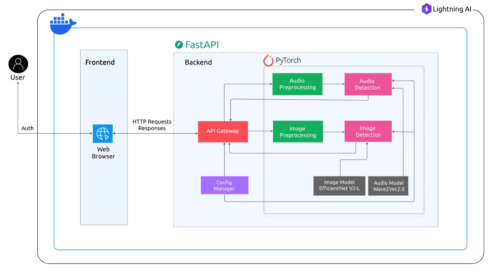

## Multimodal Deepfake Detection

[](https://www.python.org/downloads/)
[](LICENSE)

A robust web-based application for detecting synthetic media (deepfakes) in **images and audio** using state-of-the-art AI models like **EfficientNetV2** and **Wav2Vec2**. The platform offers an intuitive interface for media analysis while maintaining high security and privacy standards.

## Live Demo


## Key Features

- **Advanced Media Analysis**: Detect manipulated content across multiple formats (images, audio)
- **High-Performance AI Models**: 
  - **EfficientNetV2** for image forgery detection
  - **Wav2Vec2** for detecting voice synthesis artifacts in audio
- **User-Friendly Interface**: Drag-and-drop media upload with instant deepfake detection

## Architecture Overview

The application integrates cutting-edge AI models with a clean web-based frontend.

### Supported Formats

- **Images**: JPG, PNG
- **Audio**: MP3, WAV

### Detection Models

- **Image**: Fine-tuned **EfficientNetV2** trained to detect visual deepfake traces
- **Audio**: Fine-tuned **Wav2Vec2** model optimized for detecting synthetic voices
- **Batch Processing**: Simultaneous evaluation of multiple media files

### System Architecture Diagram




## Project Structure

```
.
├── app/
│   ├── __init__.py
│   ├── audio_detection.py       # Wav2Vec2-based audio deepfake detection
│   ├── config.py                # App settings and environment paths
│   ├── image_detection.py       # EfficientNetV2-based image detection
│   └── main.py                  # FastAPI backend entry point
│
├── config.yaml                  # Path to models and configuration values
│
├── data/
│   └── test_data/               # Sample media files (audio/image)
│
├── models/
│   ├── audio_model/             # Wav2Vec2 model files
│   │   ├── config.json
│   │   ├── model.safetensors
│   │   ├── preprocessor_config.json
│   │   ├── special_tokens_map.json
│   │   ├── tokenizer_config.json
│   │   └── vocab.json
│   │
│   └── image_model/
│       └── EfficientNetV2_model.pth  # Pretrained EfficientNetV2 weights
│
├── notebook/
│   ├── audio_detection/
│   │   └── model_train_5.0.ipynb      # Audio model training notebook
│   │
│   └── image_detection/
│       ├── image_data_download.ipynb
│       ├── image_deepfake_detection.ipynb
│       ├── image_detection_dataset.py
│       └── model_training.py
│
├── templates/
│   ├── index.html
│   ├── upload.html
│   └── static/
│       ├── css/
│       │   └── styles.css
│       └── js/
│           └── script.js
│
├── test/
│   ├── deepfakes/
│   └── real/
│
├── pyproject.toml               # Python project dependencies
├── README.md                    # Project documentation
└── uv.lock                      # Lock file for dependencies
```

## Requirements

- Python 3.10+
- Dependencies from `pyproject.toml`
- FFmpeg (for audio preprocessing)
- Trained models for both image and audio (included in `models/`)

## Installation Guide

### 1. Clone the Repository

```bash
https://github.com/Akshayredekar07/Multimodal-Deepfake-Detection.git
cd Multimodal-Deepfake-Detection/backend
```

### 2. Create and Activate Virtual Environment

```bash
python -m venv venv
source venv/bin/activate  # On Windows: venv\Scripts\activate
```

### 3. Install Dependencies

```bash
# Preferred
uv sync

# Or using pip
pip install -r requirements.txt
```

### 4. Model Check

Ensure these models are present:

* `models/audio_model/` (Wav2Vec2 model files)
* `models/image_model/EfficientnetV2_model.pth`

Also verify paths in `config.yaml`.

### 5. Run the Web App

```bash
python -m app.main:app
```

Visit: [http://localhost:8000](http://localhost:8000)

## Docker Setup

You can also run the application using Docker for a consistent environment.

### 1. Build the Docker Image

Ensure you are in the root directory of the project (where `backend/` is located) and run:

```bash
docker build -t mdfd-app .
```

### 2. Run the Docker Container

```bash
docker compose up -d
```

### 3. Access the Application

Visit [http://localhost:8000](http://localhost:8000) to use the web app.

### Notes

- The Docker image uses `uvicorn` to run the FastAPI application.
- Ensure Docker is installed on your system.
- If you need to persist uploaded data, consider mounting a volume for `/app/data/uploads` (e.g., add `-v ./data/uploads:/app/data/uploads` to the `docker run` command).

## Usage Instructions

1. **Homepage**: Learn how the platform works
2. **Upload Media**: Use the upload page to submit JPG/PNG or MP3/WAV files
3. **Detection Results**:
   * Classification: Real or Fake
   * Confidence Score
   * If possible, anomaly visualization
4. **Security**: Your media is deleted immediately after detection

## Development Guide

### Backend (FastAPI)

* `app/main.py`: Routes and endpoints
* `app/image_detection.py`: EfficientNetV2 image classification logic
* `app/audio_detection.py`: Wav2Vec2-based audio classification
* `config.yaml`: Set paths to models and hyperparameters

### Frontend

* HTML: `templates/*.html`
* CSS: `templates/static/css/styles.css`
* JavaScript: `templates/static/js/script.js`

### Training and Notebooks

* Audio: `notebook/audio_detection/model_train_5.0.ipynb`
* Image: `notebook/image_detection/model_training.py`

## Testing

Use sample files in the `test/` folder to verify output.

* `test/deepfakes/`: Example fakes
* `test/real/`: Example genuine files

## Contributing

1. Fork the repo
2. Create a new branch: `git checkout -b feature-name`
3. Commit your changes
4. Push and submit a PR

## License

This project is under the [MIT License](LICENSE).

## Contact

For help or suggestions:

* File an issue in the GitHub repo
* Email the maintainer: `akshayredekar04@gmail.com`
